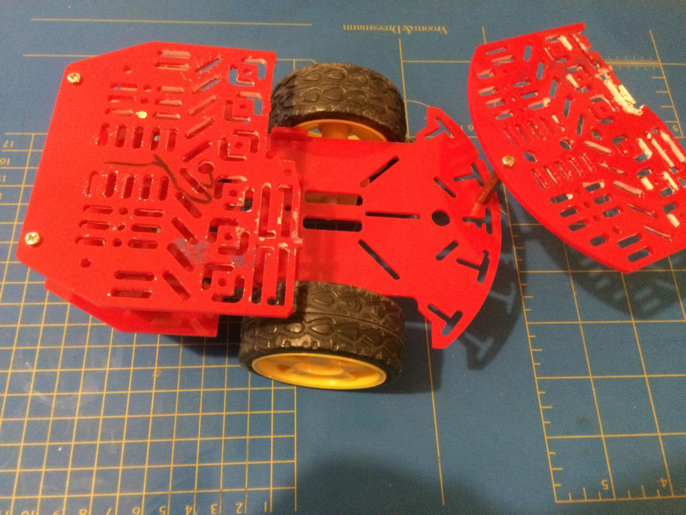

# Sammy

Sammy used to be a little toy car with **raspberry pi** running a nodeJS server.
One could control it from a command line by sending UDP requests.

Now look what time has done to it.. RIP Sammy...

